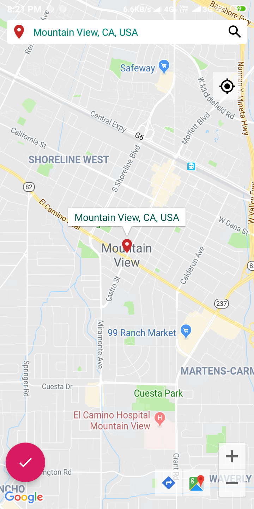
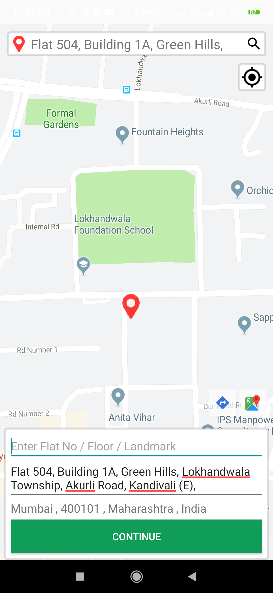
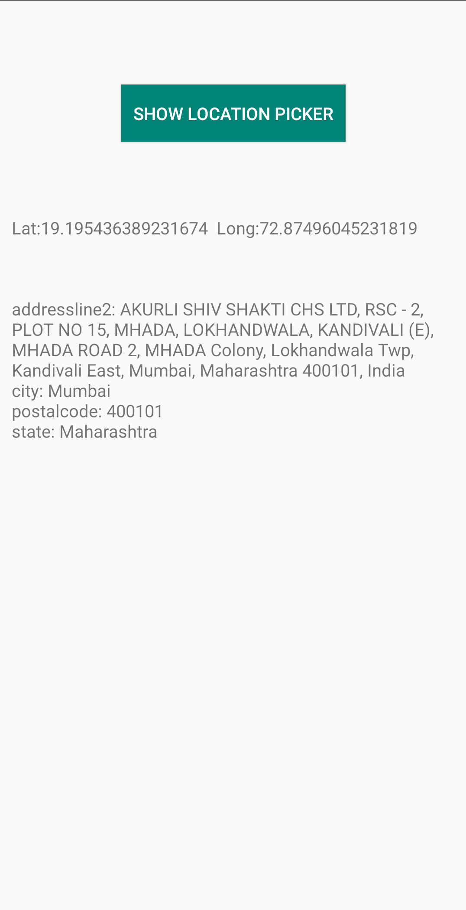

[](https://android-arsenal.com/details/1/7761)


<h1>Introduction</h1>
LocationPicker is a simple and easy to use library that can be integrated into your project.
The project is build with androidx.
All libraries and APIs used in the project are up-to-date as of now
You can get latitude,longitude and full address for selected location
Please follow below instruction to know how to use it in your project
<br/>


<br/>
<h1>Features</h1>

- Search any location using Google Places Library<br/>
- Pick any location from the map<br/>
- Edit Location and add more Details<br/>
- Get location in a bundle with city , pincode , state etc <br/>
- Open the picked location on Google Maps<br/>
- Search the Direction to the picked location from current location (using Google Maps)<br/> 

<div style="float:left">




</div>

<br/><br/>

<h1>Getting Started</h1>

**Gradle Integration**<br/>
Add it in your root build.gradle at the end of repositories:
step 1:
```gradle
  allprojects {
		repositories {
			...
			maven { url 'https://jitpack.io' }
		}
	}
```
step 2: Add the dependency
```gradle
  dependencies {
	        implementation 'com.github.shivpujan12:LocationPicker:2.0'
	}
```
<br/>
Follow below step to use LocationPicker Library

1) Configure your app in  Google API Console  to get API Key and enable services.

> https://console.cloud.google.com/apis/dashboard

2) Enable below services in API Console.

```
  Google Maps Android API
  
  Google Places API for Android
  
```

3) Declare the following things in manifest in AndroidManifest.xml file

```xml
    <uses-permission android:name="android.permission.ACCESS_COARSE_LOCATION" />
    <uses-permission android:name="android.permission.ACCESS_FINE_LOCATION" />
    <uses-permission android:name="android.permission.INTERNET" />
    <uses-permission android:name="android.permission.ACCESS_NETWORK_STATE" />
```

inside `<application>` tag add `<meta-data>` as shown below

```xml
  <application
        android:icon="@mipmap/ic_launcher"
        android:label="@string/app_name"
        android:theme="@style/AppTheme">
        <activity android:name=".MainActivity">
            <intent-filter>
                <action android:name="android.intent.action.MAIN" />
                <category android:name="android.intent.category.LAUNCHER" />
            </intent-filter>
        </activity>
        ....
        ....
        <meta-data
            android:name="com.google.android.geo.API_KEY"
            android:value="@string/your_api_key" />
    </application>
```

<br/>
<p><b>Note:</b> Create the 'your_api_key' string resource and add your api key there</p>

4) To use the LocationPicker in your activity add the following code:

    i) Inside onCreate method intialize your api key as below:<br/>
    ```java
          MapUtility.apiKey = getResources().getString(R.string.your_api_key);
    ```
      <p><b>Note:</b> Create the 'your_api_key' string resource and add your api key there</p>
    
    ii) Start Location picker request by putting below code in your view<br/>
    ```java
                  Intent i = new Intent(MainActivity.this, LocationPickerActivity.class);
                  startActivityForResult(i, ADDRESS_PICKER_REQUEST);
    ```

5) Handle your onActivityResult for getting address, latitude and longitude as:

```java
      @Override
        protected void onActivityResult(int requestCode, int resultCode, Intent data) {
            super.onActivityResult(requestCode, resultCode, data);

            if (requestCode == ADDRESS_PICKER_REQUEST) {
                try {
                    if (data != null && data.getStringExtra(MapUtility.ADDRESS) != null) {
                        // String address = data.getStringExtra(MapUtility.ADDRESS);
                        double currentLatitude = data.getDoubleExtra(MapUtility.LATITUDE, 0.0);
                        double currentLongitude = data.getDoubleExtra(MapUtility.LONGITUDE, 0.0);
                        Bundle completeAddress =data.getBundleExtra("fullAddress");
                    /* data in completeAddress bundle
                    "fulladdress"
                    "city"
                    "state"
                    "postalcode"
                    "country"
                    "addressline1"
                    "addressline2"
                     */
                        txtAddress.setText(new StringBuilder().append("addressline2: ").append
                                (completeAddress.getString("addressline2")).append("\ncity: ").append
                                (completeAddress.getString("city")).append("\npostalcode: ").append
                                (completeAddress.getString("postalcode")).append("\nstate: ").append
                                (completeAddress.getString("state")).toString());

                        txtLatLong.setText(new StringBuilder().append("Lat:").append(currentLatitude).append
                                ("  Long:").append(currentLongitude).toString());

                    }
                } catch (Exception ex) {
                    ex.printStackTrace();
                }
            }
    }
    
```

<h1>Extra Feature :wink:</h1>
<br/>
To open the LocationPicker with pre-selected location, just add extras to the Intent as below: <br/>

```java
      Intent intent = new Intent(EditorActivity.this, LocationPickerActivity.class);
      intent.putExtra(MapUtility.COUNTRY_ISO_CODE, "US"); // Only show US locations
      intent.putExtra(MapUtility.ADDRESS,address);
      intent.putExtra(MapUtility.LATITUDE, latitude);
      intent.putExtra(MapUtility.LONGITUDE, longitude);
      startActivityForResult(intent, ADDRESS_PICKER_REQUEST);
```
<br/><br/>

<h1>Bugs and Feedback :thumbsup: :thumbsdown:</h1>
For bugs, questions and discussions please use the Github Issues.
If you like this library please put a star :star: to it
<br/><br/>

<h1>Credits</h1>
> The library is referenced from https://github.com/Intuz-production/AddressPicker-Android
<br/>

<h1>Connect with me!</h1>
<a href="https://www.linkedin.com/in/asad-ali-choudhry">
<br>
<a href="https://handyopinion.com/author/asad175/">

<br/><br/>
